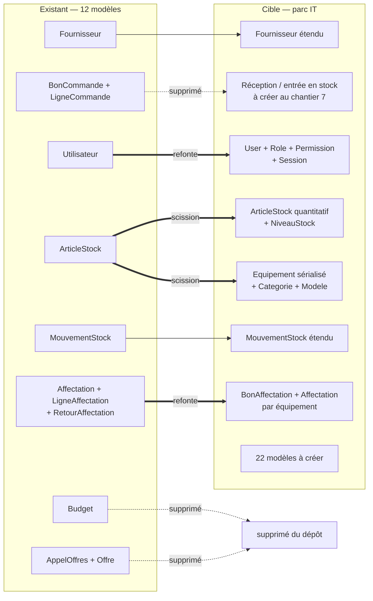
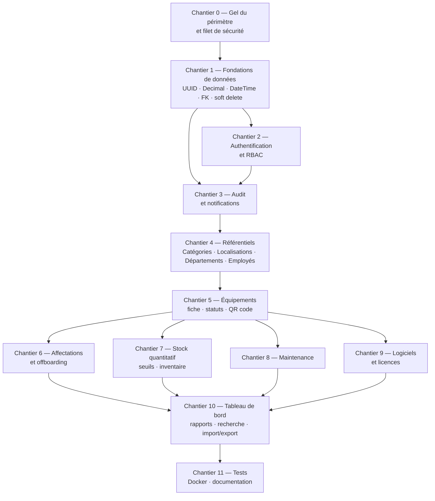

# IT Stock Manager — Plan de convergence

> Comment faire converger le code restructuré (Express + Prisma + PostgreSQL) vers l'architecture validée en Phase 1, avec un périmètre recentré sur la **gestion de parc IT**.
> Version 1.2 — 22 août 2026 · v1.1 : suppression des modules achats · v1.2 : suppression du module Fournisseurs, ajout de `Societe`, chantier 2 scindé en 2a/2b, critères d'acceptation des chantiers 5-6 (§4.5) · Fait suite au `RESTRUCTURE-REPORT.md` du 22 août 2026 et au document `01-architecture.md`.

---

## 0. Base de travail et limites de ce document

**Ce dont je dispose :** le rapport de restructuration uniquement. Je n'ai pas lu `schema.prisma`, ni les services, ni le frontend.

**Conséquence directe :** ce plan est construit sur ce que le rapport *décrit*. Les correspondances de modèles, les volumes et les points de rupture sont des hypothèses documentées, pas des constats. La **section 8** liste précisément les 14 points à vérifier dans le code réel avant de lancer le premier chantier — plusieurs peuvent modifier l'ordre des travaux.

**Trois décisions actées avec vous :**

| Question | Réponse |
|---|---|
| Objectif | Plan de convergence, puis exécution |
| Périmètre cible | **Parc IT uniquement** |
| Accès au code | Rapport seul pour l'instant |

---

## 1. Le point de départ, dit franchement

Vous avez aujourd'hui **deux choses qui ne se recouvrent qu'en partie** :

- Une application **achats et approvisionnement** qui fonctionne : fournisseurs, bons de commande, budgets, appels d'offres, analyse d'offres par IA — plus un stock simple et des affectations.
- Une architecture cible de **gestion de parc informatique** validée en Phase 1 : équipements sérialisés, QR codes, garanties, maintenance, licences, employés, offboarding, audit, RBAC.

Le recouvrement réel se limite à quatre notions : `Fournisseur`, `ArticleStock`, `MouvementStock`, `Affectation`. Sur les 31 modèles de la Phase 1, **22 n'existent pas** et 4 des 9 restants doivent être retravaillés en profondeur.

Autrement dit : la restructuration a produit une bonne fondation technique (couches, services, Prisma, PostgreSQL), mais le **domaine métier reste à construire**. C'est une bonne nouvelle sur un point : la partie difficile à rattraper — sortir du monolithe en mémoire — est déjà faite.

### 1.1 Décision du 22 août : suppression, et non gel, des modules achats

**Cette section remplace la recommandation de gel de la version 1.0.** J'avais proposé de geler les modules achats plutôt que de les supprimer ; vous avez tranché pour la suppression. La décision vous appartient et elle se défend : un dépôt sans code mort est plus simple à faire évoluer, et l'historique git conserve tout de toute façon.

| Modèle / module | Décision | Justification |
|---|---|---|
| `BonCommande` + `LigneCommande` | **Supprimé** | Hors périmètre |
| `Budget` | **Supprimé** | Hors périmètre |
| `AppelOffres` + `Offre` | **Supprimé** | Hors périmètre |
| `ia.service.ts` + client Gemini | **Supprimé** | Ne servait que l'analyse d'offres |
| `Fournisseur` | **Supprimé** (décision du 22 août, v1.2) | Le module disparaît. L'information est conservée sous forme d'un **champ texte `fournisseur`** sur `Equipement`, `Licence` et `Maintenance` — suffisant pour faire jouer une garantie ou rappeler un réparateur |
| `Utilisateur` | **Refondu** | Socle de l'authentification et du RBAC |
| `ArticleStock` | **Scindé** | Voir §2.2 |
| `MouvementStock` | **Étendu** | FK, types complets, statut avant/après |
| `Affectation` + `LigneAffectation` + `RetourAffectation` | **Refondus** | Voir §2.3 |

**Trois conséquences à traiter, pas seulement des fichiers à effacer :**

1. **Le canal d'entrée en stock disparaît.** Le flux `import-po` créait des articles avec déduction de catégorie et dates de garantie. Sa disparition est acceptable — le chantier 7 prévoit un écran « Réception / entrée en stock » qui le remplace — mais **entre les deux, les entrées se font à la main**. C'est le seul recul fonctionnel réel de cette décision.
2. **`Fournisseur` porte probablement des champs alimentés par les commandes** (montant dépensé, note, historique). Privés de leur source, ils deviennent faux plutôt que vides. Ils doivent être supprimés ou repassés en saisie manuelle explicite — pas laissés en place à afficher un chiffre figé.
3. **`GET /api/data` change de forme.** L'agrégat renvoie aujourd'hui budgets, commandes et appels d'offres ; le frontend consomme ces clés. La suppression backend et le nettoyage frontend doivent être **dans le même commit**, sinon l'application est cassée entre les deux.

**Ordre impératif : la suppression passe avant le chantier 1.** Migrer les types, les clés et les contraintes de tables qu'on efface ensuite, c'est du travail jeté — et un schéma cible plus difficile à relire. L'encadré « Gel ≠ dispense » de la version 1.0 devient sans objet : il n'y a plus de module gelé, seulement des tables conservées, qui migrent toutes.

Le mécanisme `MODULES_ACTIFS` mis en place au chantier 0 perd sa raison d'être pour les modules achats. Il peut être retiré, ou conservé s'il sert à autre chose — mais il ne doit pas rester à garder des routes qui n'existent plus.

---

## 2. Correspondance entre l'existant et la cible

### 2.1 Vue d'ensemble



### 2.2 Le point délicat : scinder `ArticleStock`

Aujourd'hui, `ArticleStock` porte manifestement **les deux natures à la fois** : le rapport parle d'articles avec catégorie et dates de garantie (donc du matériel identifiable) *et* de mouvements de type Sortie/Entrée/Rebut/Ajustement (donc de la quantité). C'est précisément la confusion que le modèle hybride de la Phase 1 (§4.2) évite.

La scission proposée :

| Nature | Devient | Critère de décision |
|---|---|---|
| Objet unique, identifiable, affecté nominativement, sous garantie | `Equipement` | Possède un numéro de série ou doit être suivi individuellement |
| Référence consommable, comptée en quantité | `ArticleStock` + `NiveauStock` | Interchangeable, consommé, pas de suivi individuel |

**Comment décider ligne par ligne au moment de la migration ?** Une règle automatique, puis une revue manuelle :

```text
si l'article a un numéro de série non vide        → Equipement
sinon si la quantité en stock est toujours 1
     et qu'il a une date de garantie              → Equipement (à confirmer)
sinon si sa catégorie ∈ {Laptop, Desktop, Monitor,
     Printer, Server, Switch, Router, Smartphone,
     Tablet, UPS, Docking Station}                → Equipement
sinon                                             → ArticleStock quantitatif
```

Le script de migration produit un **fichier de revue** listant chaque article et sa destination proposée. Vous validez ou corrigez avant exécution — jamais de bascule automatique silencieuse. Un article classé `Equipement` avec une quantité de 7 génère **7 équipements** avec des numéros d'inventaire distincts.

> À ce stade la base ne contient que le jeu de démonstration. Cette migration coûte aujourd'hui quelques heures ; avec deux ans de données réelles, c'est un projet à part entière. C'est l'argument principal de l'ordre des chantiers proposé en §4.

### 2.3 Refondre les affectations sans perdre ce qui est bien conçu

L'existant a `Affectation` + `LigneAffectation` + `RetourAffectation` : une affectation est un **document multi-lignes** — on remet à un employé un lot de matériel en une fois. La Phase 1 a une `Affectation` **par équipement**, avec la contrainte « une seule active à la fois ».

Les deux sont justes, et ils répondent à deux questions différentes :

- *« Qu'a signé Ahmed Benali le 12 mars ? »* → le document multi-lignes
- *« Où est ce portable, et depuis quand ? »* → la ligne par équipement

Je propose donc de **garder les deux**, correctement nommés :

| Modèle | Rôle |
|---|---|
| `BonAffectation` | Le document remis et signé : employé, date, motif, PDF de décharge, statut |
| `LigneBonAffectation` | Une ligne du document, qui **génère** une `Affectation` |
| `Affectation` | L'état par équipement : équipement, employé, dates, états, statut ACTIVE/RETURNED/LOST/REPLACED |
| `RetourAffectation` | **Fusionné dans `Affectation`** (`dateRetour`, `etatAuRetour`, `motifRetour`) et dans un `BonRetour` symétrique |

Le contrat d'API existant (`POST /api/assignments`, `/assignments/:id/return`) est **conservé** : il crée un `BonAffectation` et, en cascade, les `Affectation` correspondantes dans la même transaction. Le frontend actuel continue de fonctionner.

### 2.4 Les 23 modèles à créer

| Bloc | Modèles | Chantier |
|---|---|---|
| Organisation | `Societe` | 2a |
| Sécurité | `Role`, `Permission`, `RolePermission`, `Session` | 2b |
| Audit & notifications | `JournalAudit`, `Notification` | 3 |
| Référentiels | `Categorie`, `Marque`, `Modele`, `Localisation`, `Departement` | 4 |
| Personnes | `Employe` | 4 |
| Parc | `Equipement`, `Document` | 5 |
| Affectations | `BonAffectation`, `LigneBonAffectation` | 6 |
| Offboarding | `ProcessusDepart`, `LigneProcessusDepart` | 6 |
| Stock | `NiveauStock`, `Inventaire`, `LigneInventaire` | 7 |
| Maintenance | `Maintenance` | 8 |
| Logiciels | `Logiciel`, `Licence`, `AffectationLicence` | 9 |
| Configuration | `ParametresApplication` | 5 |

---

## 3. Ce que la Phase 1 doit corriger

Quatre décisions de la Phase 1 ont été prises en supposant Next.js. La restructuration a choisi Express + Vite — choix défendable et déjà opérationnel, que je ne remets pas en cause. Mais **je ne peux pas laisser le document d'architecture affirmer des choses qui ne s'appliquent plus.**

| Décision Phase 1 | Statut | Remplacement |
|---|---|---|
| **Auth.js (NextAuth v5)** §7.1 | ❌ **Caduque** | Auth.js v5 est conçu pour Next.js. Sur Express : session maison — table `Session` en base, cookie `httpOnly` signé, argon2id. Le comportement visé reste identique (sessions révocables immédiatement), l'implémentation change |
| **Server Actions** §1.4 | ❌ **Caduque** | Il n'y a qu'un seul chemin d'écriture : les routes Express. C'est plus simple, et la règle « aucune écriture hors service métier » tient toujours |
| **Format `{succes, donnees}`** §8.1 | ❌ **Abandonné** | On **conserve** le format existant : `{status:"ok", data}` en lecture, `{message, data}` en mutation, `{error}` en erreur. Le frontend en dépend, le changer ne rapporte rien |
| **Arborescence `src/app` + `src/modules`** §3 | ⚠️ **Adaptée** | Voir §3.2 |
| Protection CSRF native | ⚠️ **À implémenter** | Les Server Actions la fournissaient gratuitement. En Express : cookie `SameSite=Lax` + vérification d'`Origin` sur les mutations |
| Modèle en 5 couches | ✅ **Tient** | Déjà respecté par la restructuration |
| Modèle de données §4 | ✅ **Tient** | Sauf `Equipement`/`ArticleStock` à scinder et les affectations à refondre |
| RBAC §5 | ✅ **Tient** | La matrice est indépendante du framework |
| Audit transactionnel §7 | ✅ **Tient** | Prisma `$transaction` fonctionne à l'identique |

### 3.1 Authentification sur Express — la conception retenue

```text
POST /api/auth/login
  → limiteur de débit (5 essais / 15 min / IP+email)
  → recherche utilisateur (temps de réponse constant si absent)
  → argon2.verify(motDePasseHash, motDePasse)
  → INSERT Session { id, utilisateurId, expireLe, adresseIp, agentUtilisateur }
  → Set-Cookie: sid=<id signé>; HttpOnly; SameSite=Lax; Secure; Max-Age=8h
  → JournalAudit { action: LOGIN }

Middleware chargerSession (monté avant toutes les routes /api)
  → lit le cookie, charge Session + Utilisateur + Role + Permissions
  → rejette si expirée, si utilisateur désactivé ou supprimé
  → prolongation glissante si la session a plus de 1 h
  → attache req.contexte = { utilisateur, permissions, adresseIp }

Middleware exigerPermission('equipements.affecter')
  → 401 si pas de contexte, 403 si permission absente

POST /api/auth/logout → DELETE Session + JournalAudit { LOGOUT }
```

Une règle qui rend l'ensemble fiable : **aucune fonction de service n'accepte d'être appelée sans `contexte`**. La signature est toujours `service(contexte, donnees)`. Une route qui oublie le middleware ne compile pas — c'est TypeScript qui l'empêche, pas la vigilance.

### 3.2 Arborescence cible

```text
backend/src/
├── routes/
│   ├── index.ts                 # montage des routes du périmètre parc IT
│   ├── auth.routes.ts           # ← nouveau
│   ├── equipements.routes.ts    # ← nouveau
│   ├── employes.routes.ts       # ← nouveau
│   ├── maintenance.routes.ts    # ← nouveau
│   ├── licences.routes.ts       # ← nouveau
│   ├── stock.routes.ts          # existant, étendu
│   ├── assignments.routes.ts    # existant, réécrit sur BonAffectation
│   ├── vendors.routes.ts        # existant
├── services/                    # 8 existants + ~10 nouveaux
├── middlewares/                 # ← nouveau : session, permission, limite-debit, erreurs
├── lib/
│   ├── prisma.ts                # existant + extension soft delete + extension audit
│   ├── erreurs.ts               # existant, étendu (403, 422, 429)
│   ├── permissions.ts           # ← nouveau
│   ├── audit.ts                 # ← nouveau
│   ├── chiffrement.ts           # ← nouveau (clés de licence)
│   ├── qrcode.ts                # ← nouveau
│   └── serialisation.ts         # ← nouveau : Decimal → number, Date → ISO
└── app.ts / server.ts           # existants
```

Le frontend garde `frontend/src/` inchangé dans sa structure ; les nouveaux écrans s'ajoutent en modules.

---

## 4. Les chantiers, dans l'ordre

### 4.1 Pourquoi cet ordre

Un seul principe : **ce qui est coûteux à corriger plus tard passe en premier.**

La base ne contient aujourd'hui que le jeu de démonstration. Changer un type de colonne, une clé primaire ou ajouter une contrainte ne coûte donc presque rien — il suffit de régénérer le seed. Dans six mois avec des données réelles, chacune de ces opérations devient une migration à risque, à faire de nuit, avec sauvegarde et procédure de retour arrière.

C'est pourquoi les chantiers 1 à 3 — types de données, authentification, audit — passent **avant** toute nouvelle fonctionnalité, même si l'envie naturelle est de commencer par les écrans d'équipements.

### 4.2 Graphe de dépendances



Les chantiers 6 à 9 sont **parallélisables** une fois le chantier 5 terminé : ils dépendent tous d'`Equipement` mais pas les uns des autres.

### 4.3 Détail des chantiers

#### Chantier 0 — Gel du périmètre et filet de sécurité · effort : S

Aucune fonctionnalité, uniquement de quoi travailler sans risque.

- Branche `convergence-parc-it`, l'état actuel reste intact sur `main`
- ~~`MODULES_ACTIFS` + montage conditionnel~~ — fait au chantier 0, rendu caduc par la décision du 22 août (§1.1) : les modules achats sont supprimés, plus rien à désactiver
- Sauvegarde `pg_dump` du jeu de démonstration
- Retirer le mot de passe PostgreSQL du rapport versionné, le déplacer dans `.env`
- Vérifier l'identifiant du modèle Gemini en **désactivant temporairement le repli heuristique** : si l'appel échoue, l'IA n'a jamais fonctionné et le rapport le masquait

**Fini quand :** `npm run dev` démarre avec les seuls modules parc, `npm run build` passe, la sauvegarde est restaurable.

#### Chantier 1 — Fondations de données · effort : M — **le plus important**

Cinq corrections, une seule migration, pendant que la base est vide de données réelles.

| Correction | Détail |
|---|---|
| **Clés primaires** | `id String @id @default(uuid())` + `reference String @unique` portant l'identifiant métier (`STK-001`, `AFF-2026-001`). Les identifiants lisibles restent visibles à l'écran, ils cessent d'être des clés |
| **Montants** | `Float` → `Decimal @db.Decimal(12,2)`, avec un sérialiseur unique à la frontière HTTP : `montant.toNumber()`. Le frontend reçoit toujours un nombre JSON, son arithmétique est intacte — le problème que le rapport voulait éviter est résolu sans sacrifier la base |
| **Dates** | Colonnes `String` → `DateTime`. Le formatage FR se fait à l'affichage (`date-fns`, locale `fr`). C'est ce qui débloque les filtres par période, les alertes de garantie et tous les rapports |
| **Intégrité** | FK réelles sur `MouvementStock` avec `onDelete: Restrict`, plus `supprimeLe DateTime?` sur les tables concernées. L'historique survit à la suppression **parce que rien n'est jamais supprimé** — pas parce qu'on a retiré les contraintes |
| **Traçabilité** | `creeLe` / `modifieLe` partout, et suppression de `seq` : le tri « plus récent d'abord » devient `orderBy: { creeLe: 'desc' }` |

Deux extensions Prisma globales sont posées ici : filtrage automatique de `supprimeLe: null`, et sérialisation `Decimal`/`Date`. Écrites une fois, jamais répétées.

**Fini quand :** migration appliquée, seed régénéré, les deux typechecks passent, `GET /api/data` renvoie les mêmes valeurs qu'avant (contrôle de non-régression sur le jeu de démonstration).

**Risque principal :** la sérialisation `Decimal`. À vérifier écran par écran sur le frontend — c'est le seul endroit où ce chantier peut casser quelque chose de visible.

#### Chantier 2a — Nettoyage fonctionnel et module Sociétés · effort : M

Regroupe les points 1 à 4 et 12 de la demande du 22 août. Aucune authentification à ce stade : on nettoie et on ajoute la dimension société, pour que le chantier 2b n'ait à permissionner qu'un périmètre déjà stabilisé.

- **Suppression du module Fournisseurs** : écrans, menus, routes, service, modèle Prisma, types frontend, permissions associées. Remplacé par un champ texte `fournisseur` sur les entités qui en ont besoin (`ArticleStock` aujourd'hui, `Equipement`, `Licence` et `Maintenance` plus tard)
- **Suppression du plafond d'engagement** sur `Utilisateur` : champ, validations, DTO, endpoints, règles métier, colonne
- **Nettoyage des rôles et permissions résiduels** : `PROCUREMENT_MANAGER`, drapeaux achats de `UserManagement.tsx`, validations RAF / DAF / DGA / PDG, permissions orphelines. Tout ce qui n'a plus de module derrière disparaît
- **Modèle `Societe`** : `id`, `reference`, `nom`, `codeCourt`, `adresse?`, `ville?`, `telephone?`, `email?`, `identifiantLegal?` (ICE), `actif`, `notes?`, timestamps, soft delete
- **`Utilisateur.societeId`** (nullable) — visible et modifiable dans la fiche utilisateur
- **CRUD Sociétés** : liste, création, modification, consultation, activation/désactivation. Pas de suppression physique
- Le rattachement société est une **étiquette avec filtres**, pas un cloisonnement : tout le monde voit tout, les listes se filtrent par société. Ce choix reste réversible vers un cloisonnement strict tant que les filtres passent par la couche service

**Fini quand :** plus aucun écran, route ou permission ne mentionne un fournisseur ou un achat ; une société se crée, se modifie et se désactive ; un utilisateur se rattache à une société depuis sa fiche ; les deux `tsc --noEmit` et les builds passent.

#### Chantier 2b — Authentification et RBAC · effort : M

- Modèles `Role`, `Permission`, `RolePermission`, `Session` ; `Utilisateur` reçoit `motDePasseHash`, `roleId`, `actif`, `derniereConnexion`, `employeId?`
- Middlewares `chargerSession`, `exigerPermission`, `limiteurDebit`
- Routes `/api/auth/login`, `/logout`, `/moi`, `/changer-mot-de-passe`
- Seed des 6 rôles et de leurs permissions (matrice §5.2 de la Phase 1), **plus la permission `societes.gerer`**
- Frontend : page de connexion, contexte utilisateur, routes protégées, masquage des actions non autorisées
- **Toutes les routes `/api` existantes passent derrière le middleware** — c'est ce qui ferme l'API ouverte
- Cadrage réseau interne / VPN : HTTPS et cookie `Secure` malgré le réseau interne · rate limiting indexé sur l'email, jamais sur l'IP seule (NAT d'entreprise) · temporisation croissante plutôt que verrouillage dur · sessions 8 h glissantes avec plafond absolu 12 h · `SameSite=Lax` + vérification d'`Origin` · `Utilisateur.sourceAuth` prévu pour un SSO ultérieur, non implémenté

**Fini quand :** un appel `curl` sans cookie sur n'importe quelle route de mutation renvoie 401, et un `AUDITOR` reçoit 403 sur une création. Test automatisé, pas vérification manuelle.

**Attention :** la matrice de permissions existante dans `utilisateurs.service.ts` doit être remplacée, pas complétée. Deux systèmes de permissions en parallèle, c'est la garantie qu'un des deux sera contourné.

**Prérequis, hérité de la revue du chantier 1 :** l'extension soft delete ne couvre pas `findUnique`. Tant que ce n'est pas corrigé, `findUnique({ where: { email } })` au login laisserait un compte archivé se connecter — ce qui annule la révocation immédiate, seule raison d'avoir choisi des sessions en base plutôt que des JWT. À corriger avant d'écrire la première ligne d'authentification.

#### Chantier 3 — Audit et notifications · effort : S

- `JournalAudit` avec `valeursAvant`/`valeursApres` en `Jsonb`, liste blanche des champs (jamais de `motDePasseHash` ni de clé de licence dans un log)
- `journaliserAudit()` appelé **dans la transaction** de chaque service mutant
- `Notification` + service `notifier()` derrière une interface `CanalNotification` (in-app maintenant, email plus tard)
- Écran de consultation du journal, filtrable, réservé à `SUPER_ADMIN` et `AUDITOR`

**Fini quand :** créer, modifier puis supprimer un fournisseur produit trois entrées d'audit avec les valeurs avant/après exactes.

#### Chantier 4 — Référentiels et employés · effort : M

`Categorie` (arborescente, 17 catégories seedées), `Marque`, `Modele`, `Localisation`, `Departement`, `Employe` (avec manager auto-référencé, `societeId`). CRUD complet, écrans de paramétrage, import CSV pour les employés.

**Le matériel s'affecte à un `Employe`, pas à un `Utilisateur`** (décision du 22 août). Un employé est une personne physique avec un matricule ; il n'a pas besoin de compte dans l'application, et dans la plupart des parcs la majorité des porteurs de matériel ne s'y connectent jamais. Un `Utilisateur` peut être relié à un `Employe` via `employeId`. Les affectations existantes, aujourd'hui rattachées à des comptes, sont migrées vers des fiches employés créées à partir de ces comptes.

**Prérequis de tout le reste :** un équipement sans catégorie ni localisation n'a pas d'intérêt.

#### Chantier 5 — Équipements · effort : L — **le cœur**

- Modèle `Equipement` complet (§4.6 de la Phase 1), `Document`, `ParametresApplication`
- `Equipement.societeId` (rattachement à une société) et `Equipement.fournisseur` (champ texte, le module Fournisseurs ayant été supprimé)
- **Attributs spécifiques par type** : `imei`, `iccid`, `numeroSim`, `operateur`, `adresseMac` — colonnes nullables typées, **pas** un champ JSON générique. Elles restent filtrables, validables et indexables ; un `Json` fourre-tout ne l'est pas. Le formulaire n'affiche que les champs pertinents pour la catégorie choisie
- **Migration de scission** `ArticleStock` → `Equipement` / `ArticleStock`, avec le fichier de revue de §2.2
- Génération des numéros d'inventaire et des jetons QR
- Liste avec filtres avancés, pagination serveur, recherche `pg_trgm`
- Fiche équipement complète et ses actions (§27 de la Phase 1)
- Génération et impression des QR codes, page `/scan` utilisable au téléphone

**Fini quand :** les articles de démonstration sont correctement répartis, chaque équipement a un QR fonctionnel, la fiche affiche les 24 champs.

#### Chantier 6 — Affectations et offboarding · effort : L

- `BonAffectation` / `LigneBonAffectation` / `Affectation` selon §2.3, migration des affectations existantes
- Index unique partiel garantissant une seule affectation ACTIVE par équipement
- Flux affecter / retourner / transférer / remplacer (§6.1 et §6.2 de la Phase 1)
- `ProcessusDepart` et son écran de checklist, avec le verrou de clôture
- PDF de décharge

**Fini quand :** deux affectations simultanées du même équipement sont impossibles — test de concurrence, pas revue de code.

#### Chantier 7 — Stock quantitatif · effort : M

`NiveauStock` par localisation avec `CHECK quantite >= 0`, seuils d'alerte, `Inventaire`/`LigneInventaire` avec génération automatique des ajustements à la clôture, réactivation contrôlée de l'import depuis bon de commande comme canal d'entrée.

#### Chantier 8 — Maintenance · effort : M

`Maintenance` complète, machine à états (§6.4), pré-remplissage de `sousGarantie`, historique dans la fiche équipement, coût de possession.

#### Chantier 9 — Logiciels et licences · effort : M

`Logiciel`, `Licence` (clé chiffrée AES-256-GCM, permission dédiée pour la lecture, chaque lecture auditée), `AffectationLicence`, alertes d'expiration. `nombreUtilisees` calculé, jamais stocké.

#### Chantier 10 — Tableau de bord, rapports, recherche, import/export · effort : L

Statistiques et graphiques (§5 de la Phase 1), 11 rapports filtrables et exportables, recherche globale, import Excel/CSV en 6 étapes avec aperçu et confirmation, exports Excel/CSV/PDF.

#### Chantier 11 — Tests, Docker, documentation · effort : M

Vitest sur les services critiques (permissions, affectation, mouvements, offboarding), Playwright sur les parcours, `docker-compose` (PostgreSQL + backend + frontend), CI exécutant les deux typechecks et les migrations sur une base temporaire, README réécrit.

### 4.4 Récapitulatif

| Chantier | Effort | Bloquant pour |
|---|---|---|
| 0 — Gel et filet | S | Tout |
| 1 — Fondations de données | M | Tout |
| 2a — Nettoyage fonctionnel et Sociétés | M | 2b |
| 2b — Auth et RBAC | M | Mise en production |
| 3 — Audit et notifications | S | Conformité |
| 4 — Référentiels et employés | M | 5 à 9 |
| 5 — Équipements | L | 6 à 9 |
| 6 — Affectations et offboarding | L | — |
| 7 — Stock quantitatif | M | — |
| 8 — Maintenance | M | — |
| 9 — Logiciels et licences | M | — |
| 10 — Tableau de bord et rapports | L | — |
| 11 — Tests, Docker, doc | M | Production |

*S ≈ une demi-journée à une journée · M ≈ deux à quatre jours · L ≈ une semaine.* Ordres de grandeur pour un développeur à temps plein, à ajuster une fois le code réel consulté.

---

### 4.5 Critères d'acceptation des chantiers 5 et 6 — demande du 22 août

Les points 5 à 10 de la demande décrivent le comportement attendu mieux que ne le faisait la version 1.0 de ce plan. Ils ne constituent pas un chantier à part : ce sont les **critères de recette** des chantiers 5 et 6, qui construisent les tables sur lesquelles ils reposent.

#### Historique des affectations — chantier 6

Pour chaque matériel, l'historique doit restituer : détenteur actuel · détenteurs précédents · date d'affectation · date de restitution · date de réaffectation · site · société · état du matériel à la remise et au retour · motif ou commentaire.

Chaque changement de détenteur crée une **nouvelle ligne** ; aucune ligne n'est écrasée ni modifiée. Exemple attendu sur `IT-PC-001` :

```text
01/02/2026  Affecté à       Employé A
15/05/2026  Restitué        état : bon
16/05/2026  Réaffecté à     Employé B
10/08/2026  Restitué        état : correct
12/08/2026  Réaffecté à     Employé C
```

Consultable depuis trois endroits : la fiche du matériel, la fiche de l'employé, et une vue générale des affectations filtrable.

#### Formulaire d'affectation en deux temps — chantier 6

1. **Choix du type de matériel** — liste alimentée dynamiquement depuis les catégories réellement présentes en stock. Aucune liste codée en dur.
2. **Choix du matériel** — la liste ne contient que les équipements de ce type dont le statut est `AVAILABLE` : ni affectés, ni sortis, ni réformés, ni en maintenance. Chaque ligne affiche numéro d'inventaire, désignation, marque, modèle, numéro de série, et selon la catégorie l'IMEI, l'ICCID et l'opérateur.

La double affectation est impossible — garantie par l'index unique partiel sur les affectations actives, pas par un contrôle dans l'interface.

#### Cohérence des statuts — chantier 6

| Opération | Effet |
|---|---|
| Affectation validée | Statut → `ASSIGNED` · disparaît des disponibles · ligne d'historique créée · détenteur courant mis à jour |
| Restitution | Affectation active clôturée · historique conservé · statut → `AVAILABLE` si l'état constaté le permet, sinon `MAINTENANCE` ou `DAMAGED` |
| Réaffectation | Ancienne affectation clôturée **puis** nouvelle créée, dans la même transaction · les deux visibles à l'historique |

#### Recette fonctionnelle

Les 18 scénarios de la demande servent de recette aux chantiers 2a, 2b, 5 et 6 : connexion · consultation du stock · création et modification d'un article · consultation des sociétés · rattachement d'une société à un utilisateur · création d'une affectation · sélection d'un type · filtrage des disponibles · affectation · refus de la double affectation · restitution · réaffectation · consultation de l'historique · vérification des rôles · absence de tout écran achat ou fournisseur · build frontend · build backend · absence d'erreur console et API.

---

## 5. Les trois premiers jalons de mise en production

Il n'est pas nécessaire d'attendre le chantier 11 pour utiliser l'application.

| Jalon | Chantiers | Ce que vous pouvez faire |
|---|---|---|
| **J1 — Base saine** | 0 à 3 | L'application achats existante, mais authentifiée, auditée et sur des types corrects. Utilisable en interne |
| **J2 — Parc opérationnel** | 4 à 7 | Inventaire du parc, affectations, retours, offboarding, stock avec alertes. **C'est le jalon qui apporte la valeur métier** |
| **J3 — Complet** | 8 à 11 | Maintenance, licences, rapports, déploiement Docker |

---

## 6. Ce qui risque de mal se passer

| Risque | Probabilité | Parade |
|---|---|---|
| La scission `ArticleStock` classe mal des articles | Élevée | Fichier de revue validé manuellement avant migration ; script rejouable ; sauvegarde préalable |
| La sérialisation `Decimal` casse un calcul frontend | Moyenne | Sérialiseur unique et centralisé ; revue écran par écran au chantier 1 ; c'est le seul risque de régression visible |
| Fermer l'API casse le frontend existant | Moyenne | Middleware d'abord en mode journalisation seule (on observe qui appelle quoi), bascule en refus une fois la liste vide |
| Deux systèmes de permissions cohabitent | Moyenne | L'ancienne matrice est **supprimée** au chantier 2, pas conservée « au cas où » |
| Une référence orpheline aux modules supprimés subsiste (import, type, clé d'API, entrée de menu) | Élevée | `grep` exhaustif backend + frontend après suppression ; les deux `tsc --noEmit` et `npm run build` doivent passer |
| L'ordre des chantiers glisse vers les écrans | Élevée | C'est le risque le plus banal et le plus coûteux. Les chantiers 1 à 3 ne se rattrapent pas |

---

## 7. Décisions qui vous appartiennent

Trois points que je ne trancherai pas seul :

1. ~~Le sort des modules achats.~~ **Tranché le 22 août : suppression.** Voir §1.1 pour les trois conséquences à traiter.
2. **La migration UUID.** Elle est presque gratuite maintenant, elle ne le sera plus jamais. Mais elle change les identifiants visibles dans les URL. Si vos utilisateurs ont l'habitude de `STK-001` dans l'adresse, on garde `reference` comme identifiant d'URL et l'UUID reste interne.
3. **Le niveau d'exigence sur l'authentification.** Application interne derrière un VPN, ou accessible depuis Internet ? La réponse change la sévérité du rate limiting, la durée des sessions et la nécessité d'une double authentification.

---

## 8. À vérifier dans le code réel avant de démarrer

Ce plan repose sur le rapport. Quatorze points doivent être confirmés — plusieurs peuvent modifier l'ordre des chantiers.

| # | À vérifier | Impact si l'hypothèse est fausse |
|---|---|---|
| 1 | `ArticleStock` contient-il un champ numéro de série ? | Change la règle de scission du chantier 5 |
| 2 | Existe-t-il déjà `creeLe`/`createdAt` quelque part ? | Peut alléger le chantier 1 |
| 3 | Quels montants exactement sont en `Float` ? | Périmètre de la migration Decimal |
| 4 | Format réel des dates stockées en `String` | Complexité du script de conversion |
| 5 | `RetourAffectation` : structure et branches d'action | Conception du chantier 6 |
| 6 | La matrice de permissions de `utilisateurs.service.ts` est-elle lue quelque part ? | Si oui, le frontend en dépend et la bascule doit être coordonnée |
| 7 | Le frontend utilise-t-il un routeur (React Router) ? | Conception des écrans et des routes protégées |
| 8 | shadcn/ui est-il déjà en place, ou du Tailwind brut ? | Effort d'interface sur tous les chantiers |
| 9 | Y a-t-il déjà une gestion d'état (TanStack Query, Zustand) ? | Conception du chantier 2 côté frontend |
| 10 | Les services valident-ils leurs entrées, et avec quoi ? | Ajout de Zod ou réutilisation de l'existant |
| 11 | `import-po` : comment déduit-il la catégorie et la garantie ? | Réutilisable directement au chantier 7 |
| 12 | Identifiant exact du modèle Gemini et comportement réel du repli | Savoir si l'IA a déjà fonctionné |
| 13 | Volume réel en base : seed uniquement, ou données saisies ? | **Détermine si le chantier 1 est bon marché ou risqué** |
| 14 | Existe-t-il des tests ? | Filet disponible pendant la migration |

Le point 13 est le plus important. Si des données réelles ont déjà été saisies, tout le raisonnement « c'est gratuit maintenant » tombe et le chantier 1 doit être rejoué avec une vraie stratégie de migration.

---

## 9. Pour démarrer

Le plus utile que vous puissiez faire : **m'envoyer le dépôt**, même partiel. En priorité `backend/prisma/schema.prisma`, `backend/src/services/`, et `frontend/src/App.tsx` avec la configuration du routeur. Cela permet de répondre aux 14 points ci-dessus et de remplacer les hypothèses de ce document par des faits.

Sans cela, je peux produire dès maintenant le chantier 0 et le schéma Prisma cible du chantier 1 — mais vous devrez les adapter à la main, et je vous signalerai chaque endroit où j'ai deviné.
